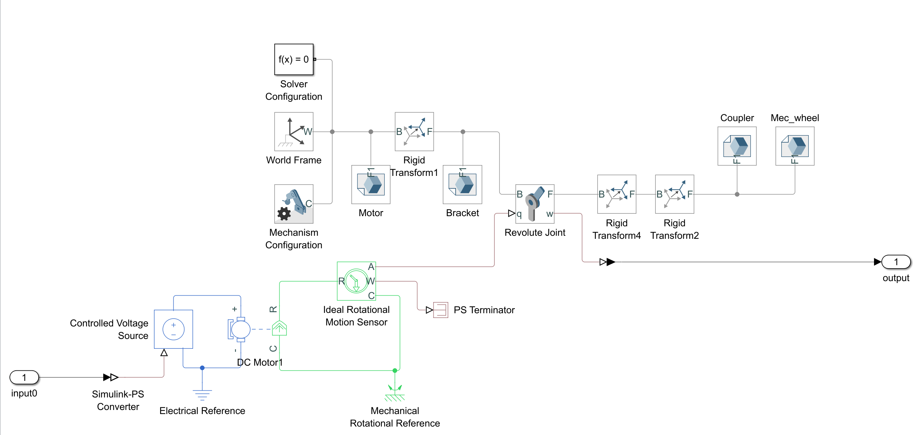

# Digital Twin Matlab Simulink

## Development

 This project consists of the modeling of a DC-Motor in Matlab Simulink using the Simscape library. This will allow us to create a digital twin with the motor parameters that could be useful in simulations and physical applications for testing. To further confirm the accurate modeling of the motor, a plant equation will be used and graphed to confirm the compatibility of both models. 

 One thing to note is that for visualization purposes and for the project not to be overcomplicated, a well-documented motor from Maxon will be selected and the CAD model of the motor will only be used as demonstration. Meaning that the CAD model and the parameters used from the Maxon motor do not correspond with each other. It would not have any negative effects since the process can be followed in the same way to achieve the same results for a single motor. 

To start with the modeling, first comes the selection of the motor. In the Maxon Motors web page (https://www.maxongroup.us/maxon/view/content/index) a motor was selected in the online shop by selecting the parameters:

- 22 W 
- 26 mm
- 20-50 mNm

In this case, the selected motor was the following:

What is important about the motor, is its datasheet where all parameters that are needed for the characterization can be found. The parameters for this specific motor are as follow: 

The main problem lies in the characterization of the motor itself, since some of its parameters are not easy to measure. By analyzing a motor that has no label or that its parameters cannot be found, it would be especially hard to measure the inertial moments. But to continue with the development, now the general transfer function of a DC-Motor is needed to start. With the transfer function, the parameters needed with their respective units are:

- Terminal resistance [Ω]
- Terminal inductance [H]
- Back-emf constant [V/(rad/s)]
- Torque constant [Nm/A]
- Rotor's inertial moment [Kgm^2]
- Motor's load inertial moment [Kgm^2]

The Back-emf constant can be obtained with the speed constant, since Kb = 1/Kv 

Once the transfer function is obtained, it is time to work with the simscape library of Matlab Simulink and use the same parameters to build a digital twin of the DC-Motor. First, in Simulink, there are some blocks that need to be placed for the simulations to work:

- Solver configuration
- World frame
- Mechanism configuration

The only block to configure is the mechanism configuration in case we want gravity in another axis. 

Then the CAD model should be uploaded into the File Solid block. It is important to note that the order in which the blocks are connected is important and the Rigid transform blocks help rotate the models. It is recommended to build up from the assembly in CAD and export the models, otherwise there will be a lot of tinkering around rotating the models to get the look needed. In the File Solid block, besides the upload of the .step file of the CAD model, there are options to give it color and reorient it to have the gravity in a specific axis. Next is the revolute joint, which will make anything connected after it to rotate in a given direction. The last part consists of using the electrical and mechanical blocks to build up the circuit that will simulate the motor. The DC-Motor block is where all the parameters are going to be entered. The Motion Sensor block will allow to measure and inherit the acceleration to the digital model for it to rotate in the simulation. 

Now that both the transfer function and the digital twin are completed. They can be both compared to validate the digital twin and its accuracy. With the same input to both, when comparing the output in an oscilloscope, the graphs should be the same. In this case, since one is on top of the other, only one can be seen but if toggled, it confirms the validation of the model:

## File organization

 There are three folders that make up the repository. The Matlab folder includes the step files for the Simulink simulation as well as the Simulink file where the digital twin is stored. Finally, the SolidWorks motor assembly folder contains the CAD files for the model of the DC-Motor used in the simulations. 

To learn more about the Multibody library and its capabilities visit the MathWorks Simscape Multibody documentation (https://la.mathworks.com/help/sm/index.html)

## Usage example with piston model

https://www.youtube.com/watch?v=egThLwGQqlk 
